# 🧩 Chrome Extention to increase reading area in gemini UI

## 📑 Table of Contents

- **[Overview](#-overview)**
- **[Problem](#️-problem)**
- **[Solution](#--solution)**
- **[Result](#-result)**
- **[Author](#-author)**

## 📌 Overview:

This project started as a small frustration and turned into a practical solution.

While working with AI tools, I noticed how much **UI design affects focus and understanding**. Limited reading space, unnecessary elements, and visual clutter were making it harder to follow long responses and connect ideas.

Instead of working around it, I **analyzed the interface using DevTools and built a lightweight Chrome extension** to remove unnecessary elements and improve usability.

## ⚠️ Problem:

*Working with AI requires sufficient space to read and connect ideas, but a restrictive UI makes it difficult to understand the full context.*

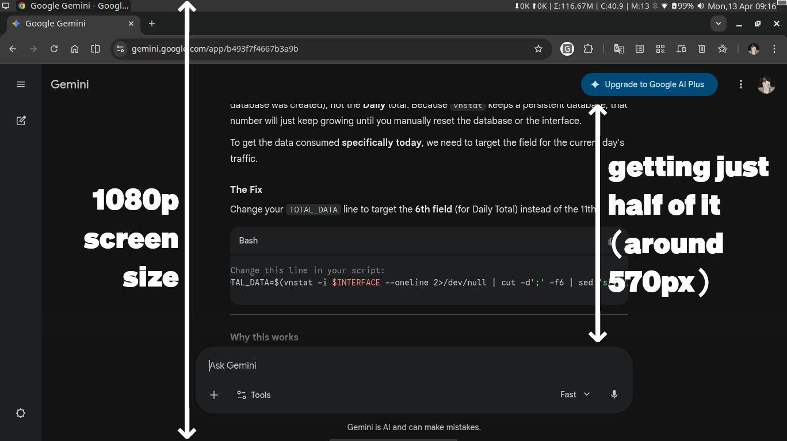

*I recently had that experience with Gemini’s UI.*

*The usable reading space felt unnecessarily constrained:*

* *A large top banner taking up vertical space*

    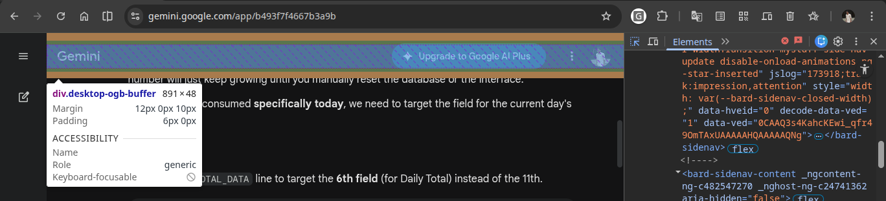

* *Shadow effects in the input box hiding nearby text*

    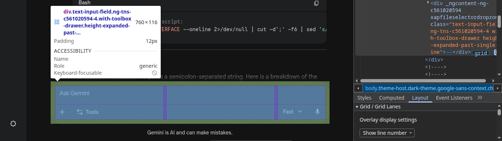

* *Constant disclaimer banners*

    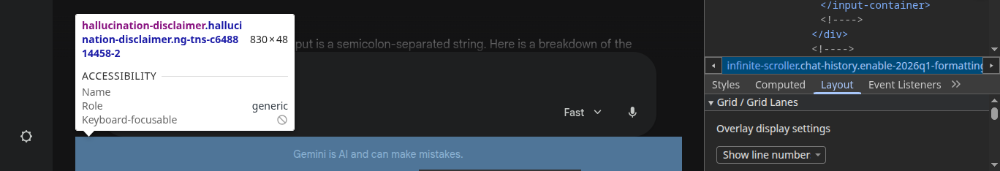

It was frustrating enough that I decided to fix it myself.

## 🔧  Solution:

**What I did:**

* *Opened browser DevTools and identified unwanted UI elements*
* *Took structured notes on what needed to be removed*
* *Enabled vertical tabs via chrome://flags to reclaim vertical space*

    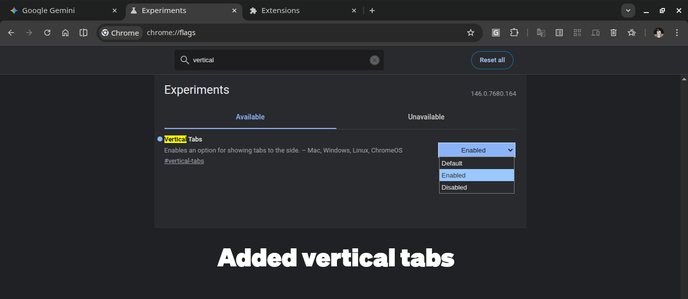

* *Built a lightweight Chrome extension*

    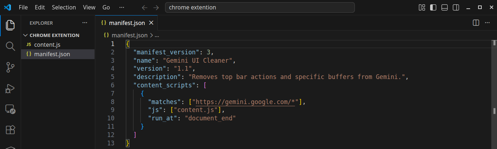

* *Used MutationObserver to ensure the changes persist even after refresh*

    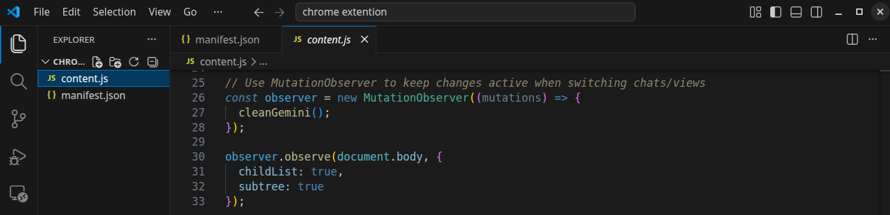

* *Loaded my custom extention*

    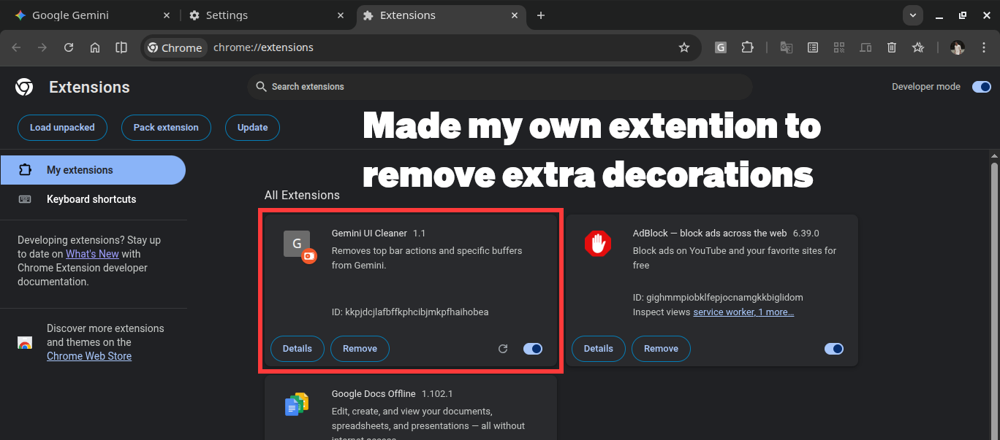

## 🚀 Result:

* *Cleaner, distraction-free interface*

    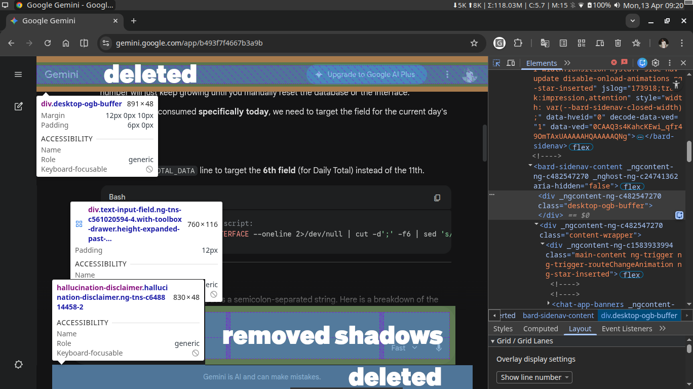

* *Increased usable vertical space from <580px to 800px+*

    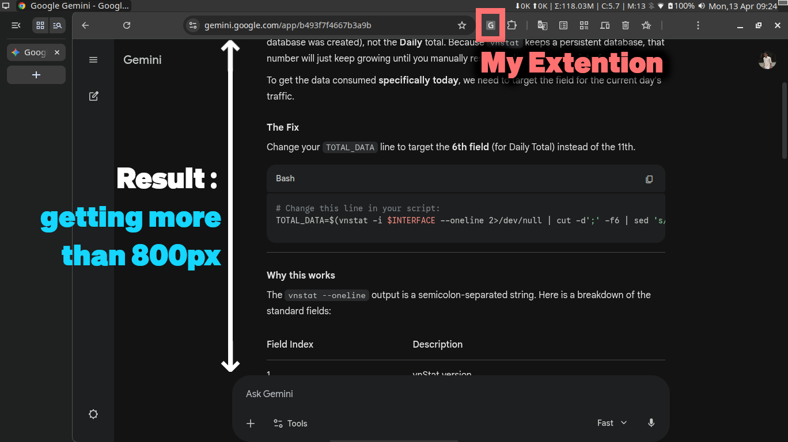

* *Significantly better reading and interaction experience*

**This was a small side experiment, but a powerful reminder:**

### 👉 As engineers, we don’t have to accept inefficiencies — we can improve the tools we use every day.

## 👨‍💻 Author

**`Hi, I’m Sonu — a DevOps Engineer`** focused on building practical, real-world solutions.

I enjoy **working with Linux, automation, and cloud-native tools**, and I like solving problems by understanding systems deeply and improving them with simple, effective solutions.

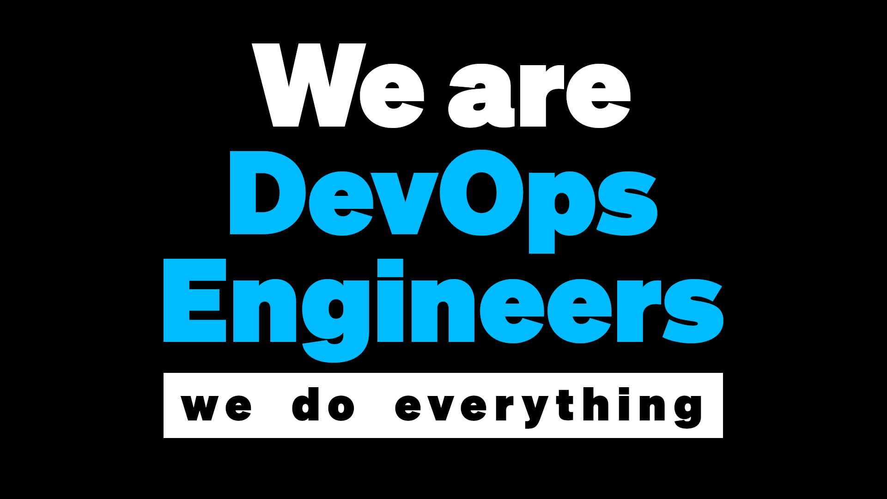

